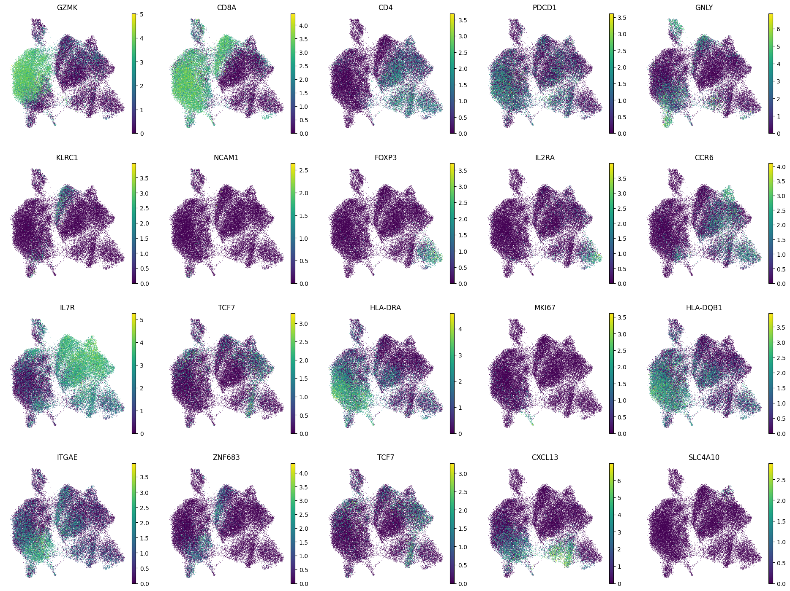
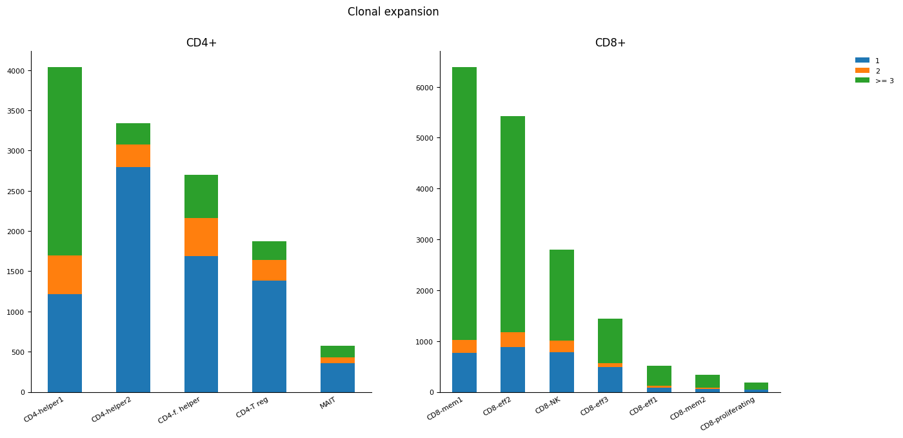
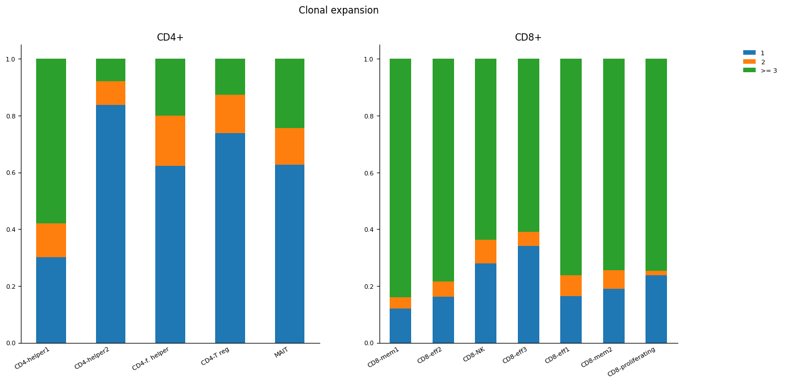
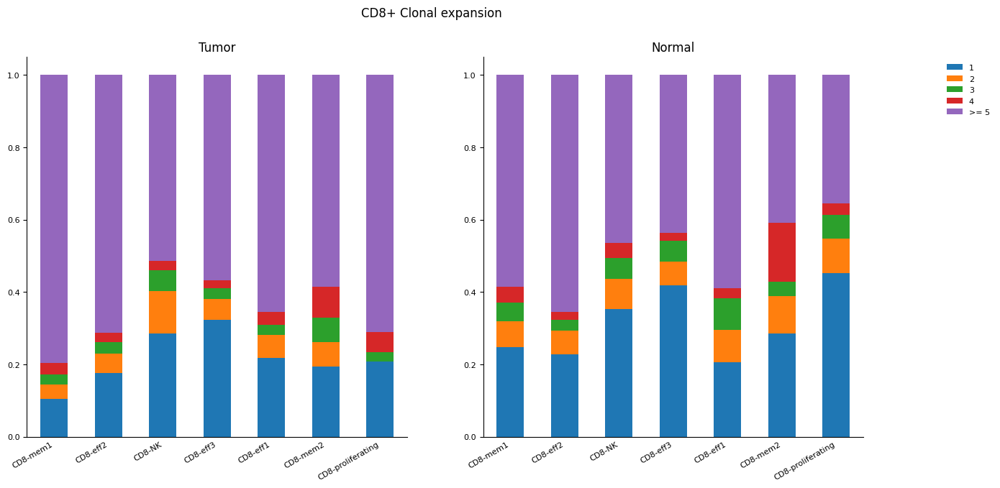

# bi-2023-tcr-tils

# Re-analysis of the public dataset: comparison and evaluation of T cells in paired tumor and normal lung single cell samples

---
## Motivation
Due to numerous mutations in the tumor genome, the neoplasm expresses mutation-associated neoantigens (MANA) that can trigger an immune response against cancer in patients. However, as the tumor evolves, malignant cells often acquire the ability to evade the immune response by expressing checkpoint proteins. Immunotherapy using antibodies against these checkpoints has been developed, but a significant number of patients do not respond to this treatment. Biomarkers, such as the expression of checkpoint proteins, tumor mutational load, and neoantigenic load, are used to determine the suitability of immunotherapy. These biomarkers are particularly relevant for highly mutated cancers like melanoma and lung cancer. However, they are not comprehensive, highlighting the need for further research on the immune component of tumors and also dysfunctional programs in MANA specific tumor-infiltrating lymphocytes (TILs).

Our project is based on open data from the article [“Transcriptional programs of neoantigen-specific TIL in anti-PD-1-treated lung cancers”](https://www.nature.com/articles/s41586-021-03752-4). The data can be aqcuired from ["GEO GSE176021"](https://www.ncbi.nlm.nih.gov/geo/query/acc.cgi?acc=GSE176021). 
<!-- Samples being used in this project, as the example download can be seen in source notebook. -->

## Methods and Results

The notebook with the full analysis can be found in this repo. Here I present and summarize the main results of the work. A short recap can also be found in the presentation. 

<!--  -->

The data was obtained from GEO (GSE173351) and contains Cell Ranger (v3.1.0) output - gene expression matrix and TCR data for each sample. Quality control, clustering, and annotation single-cell sequencing data were performed using the Scanpy package (v.1.9.1) for Python (v.3.8.11) (Wolf F. A., et al., 2018). For working with TCR data, Scirpy package (v.0.12.0) for Python (Sturm G., et al. 2020) was used. We querried VDJdb for TCR specificity

### QC and filtration

Low-quality cells were filtered out if:

* the number of detected genes was below 250 or above 2500
* the proportion of mitochondrial gene counts was higher than 10%
* the proportion of ribosomal gene counts was lower than 10%

Doublets were removed with with the help of `Scrublet`

Mitochondrial genes, and genes associated with poorly supported transcriptional patterns were also removed from the analysis

### Clustering and annotation

TCR, immunoglobulin and mitochondrial genes, as well as features that constitute Interferon I mediated pathway,  were excluded from clustering  to make sure that clustering result will not be influenced by their variability.

PCA was performed based on the 3,000 most variable genes. UMAP on PCA results have shown that cells group by samples of their origin, indicating the need for a batch effect correction. 

After harmonization, cell clusters are more evenly distributed among patients, however, the biological difference of the tumor/normal immune environment is not lost

Leiden clustering resulted in 14 separate clusters, that were annotated using combination of general CD4/CD8 markers with common subset specific markers:

* *FOXP3* for Tregs; 
* *MKI67* for proliferating cells;  
* *CXCL13* for Follicular helpers; 
* *GZMA*, *GZMB*, *GZMK* for effector cells; 
* *ZNF683* and *ITGAE* for memory cells; 
* *KLRC1* for NK cells; 
* *SLC4A10* for MAIT cells

<!--  -->

Differentially expressed genes were found using wilcoxon test for each cell type vs all other cells. Compared to the original article, we obtained a bit fewer clusters, namely original publication clusterised CD4+ helpers deeper. Other results are comparable with original publication.
 

As expected, cellular distribution in tumor and normal sample is highly different:

* CD8+ effector2 cells are enriched in Tumor, while  CD8+ effector1 – in Normal tissue
* Both CD4+ helper subtypes are enriched in Normal, although  CD4+ Follicular helpers and CD4+ T reg are more specific for Tumor
* CD8+ mem1 is enriched in Tumor

## TCR seq integration

The single cell sequencing data is combined to TCR seq by cell barcode. The paired sequencing is done separately on two subsets of cells. Obviously it results in some ammount of cellular dropouts -- not all barcoded cells have a matched sequenced TCR. In our case most of TCRs were succesfully matched and here we assess the proportion of succesfully matched cells, which was high enough for all of the samples.

<!--  -->

<!--  -->

We observe that CD8+ cell clones are highly more expanded than CD4+. That illustrates highly active cytotoxic processess in the tissue, as CD8+ cells are the main killing actors. TCR diversity was concordant with that finding: alpha diversity of CD8 cell clonotypes was higher in tumor cells.

<!--  -->

<!--  -->

Here, we shall also note that different subsets of CD8+ cells were enriched in tumor and normal tissues -- namely, CD8+ eff1, eff2 and mem1 are higher overexpanded in Tumor. That states that different cellular subtypes are most likely expanded to tackle different pathogenic sources. Whereas influenza-specific cells should be the most abundant in normal lung, MANA-specific CD8 cells should be more numerous in the tumour. Indeed, query to VDJdb showed that proportion of CD8+ TCRs specific to common lung pathogens (*InfluenzaA*, *SARS-CoV-2*, *M.tuberculosis*) was 1.4 fold higher in normal subset (1.53% vs 1.11%). 

<!--  -->

Exploring the largest subclones, we note that Tumor and Normal samples do not share cellular compositions with Normal composition being highly more variable. As tumor immunity is occupied with its fight with malignant cells, there are less expanded clonotypes with cells being specific to other pathogenic species.

<!--  -->

## Clonotype networks

Construction of a clonotype network by computing distances between CDR3 sequences reveals a set of public clonotypes - clonotype clusters shared by all of the patients, illustrating possible specificity to a common pathogen (the clonotype network has been defined through amino acid alignment with distance based on BLOSUM62 matrix. Two clonotypes were connected in the network with distance of their  CDR3 lower than 10). The query to VDJdb  (Shugay M., et al. 2018) has shown that TCRs from one of public clonotype networks (`1238`) were indeed specific for antigens from single pathogenic species - CMV.

 
 
 ## Epitope specificity
 
Query to VDJdb has revealed specificity of some TCRs to epitopes of common pathogens. However, as the neoantigens are tumor specific, it is impossible to mine TCR specificity from public databases. In fact, exploring transcriptional programs of MANA specific cells would be of greatest interest. 

## Conclusion 
In this project I have explored the possibilities of paired RNAseq+TCRseq on a public dataset of matched tumor and normal tissues in resectable non-small cell lung cancer.  

* The T-cells were clustered and annotated into subgroups.
* Cell type enrichment was explored for Tumor and Normal samples.
* Matched TCR sequencing has allowed for researching clonal expansion independently by subtypes. 
* Construction of clonotype networks has revealed a specificity to a public epitope. 

It would be of great interest to explore and compare transcriptional programs of tumor associated antigen specific clones in the subsequent works. 

## Literature 

Caushi J. X., Zhang J., Ji, Z., et al. (2021). Transcriptional programs of neoantigen-specific TIL in anti-PD-1-treated lung cancers. Nature, 596(7870), 126-132. doi: 10.1038/s41586-021-03752-4

Wolf F. A., Angerer P., Theis F. J. (2018). SCANPY: large-scale single-cell gene expression data analysis. Genome biology, 19, 1-5. doi: 10.1186/s13059-017-1382-0

Hao Y., Stuart T., et al. (2022). Dictionary learning for integrative, multimodal, and scalable single-cell analysis. bioRxiv, 2022-02. doi: /10.1101/2022.02.24.481684

Sturm G., Szabo T., et al. (2020). Scirpy: a Scanpy extension for analyzing single-cell T-cell receptor-sequencing data. Bioinformatics, 36(18), 4817-4818. doi: 10.1093/bioinformatics/btaa611

Li H., van der Leun A. M., et al. (2019). Dysfunctional CD8 T cells form a proliferative, dynamically regulated compartment within human melanoma. Cell, 176(4), 775-789. doi: 10.1016/j.cell.2018.11.043

Shugay M., Bagaev D. V., et al. (2018). VDJdb: a curated database of T-cell receptor sequences with known antigen specificity. Nucleic acids research, 46(D1), D419-D427. doi: 10.1093/nar/gkx760 
